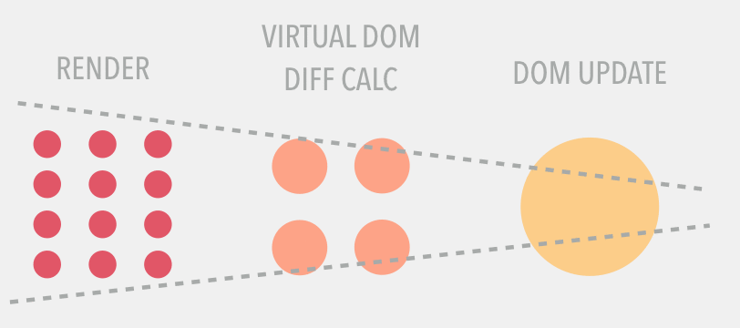
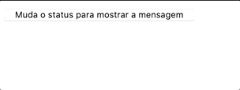
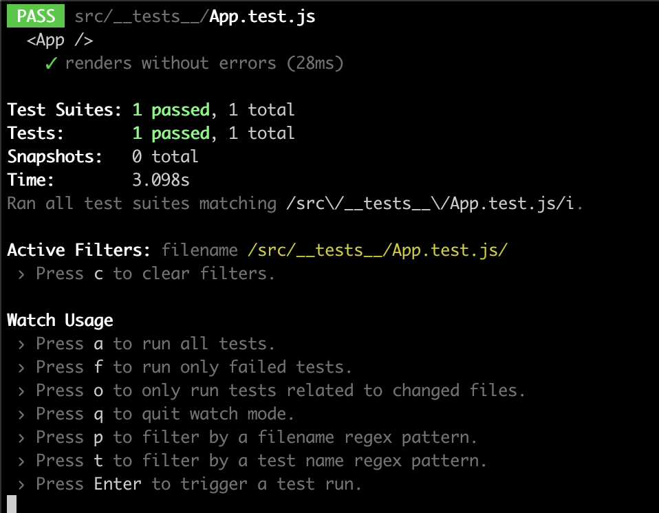

# Vamos do início! :sunglasses:
======================  **Este é um conteúdo que está em constante atualização** ====================== 

========================== **Este é um conteúdo que NÃO está finalizado** ==========================

Pra ficar mais fácil, você pode escolher se guiar pelas temas abaixo, só clicar em alguma das palavras-chaves e você vai direto pro tópico desejado.

* [O que é Reactjs](https://github.com/bragamat/aprenda-reactjs-testando/tree/solucao/0#o-que-é-reactjs-)
* [Como Começar Com Reactjs ?](https://github.com/bragamat/aprenda-reactjs-testando/tree/solucao/0#como-come%C3%A7ar-com-reactjs)
* [Por que testar ?](https://github.com/bragamat/aprenda-reactjs-testando/tree/solucao/0#por-que-testar-)
* [O que testar ?](https://github.com/bragamat/aprenda-reactjs-testando/tree/solucao/0#o-que-testar-)
* [Como Testar ?](https://github.com/bragamat/aprenda-reactjs-testando/tree/solucao/0#como-testar-)

# O que é Reactjs ?

## Introdução
 - _"O React é uma biblioteca JavaScript de código aberto com foco em criar interfaces de usuário em páginas web desenvolvida e mantida pelo facebook"_. Essa é a definição pelo [wikipédia](https://pt.wikipedia.org/wiki/React_(JavaScript)). É um biblioteca dentro do ambiente _react_ que nos ajuda no desenvolvimento de interfaces amigáveis e performáticas, renderizando somente o que precisa ser renderizado! :smiley: 
 - É uma **biblioteca** baseada em componentes que conseguem gerenciar o próprio estado individualmente. Sendo extremamente prática a reutilização desses componentes em vários lugares da nossa aplicação.
 - O react utiliza uma ferramenta chamada [Virtual Dom (VDOM)](https://pt-br.reactjs.org/docs/faq-internals.html#what-is-the-virtual-dom) que, em resumo, faz a diferenciação do estado da aplicação no DOM do browser com o estado da aplicação em si, renderizando somente o que é necessário! Pra isso, uma outra biblioteca é utilizada: O [ReactDOM](https://pt-br.reactjs.org/docs/react-dom.html#overview) é resposável por renderizar o container da aplicação em um template também (entre vaárias outras coisas). Esta imagem ilustra muito bem como ocorre essa diff:

 

 Está sendo re-renderizado somente a diferença.


## Como Começar Com Reactjs
- Por ser uma lib simples de javascript, a gente pode simplesmente importar um direto de um servidor "publico" em um html simples.
Então vamos criar um arquivo "index.html" simples pra gente começar a entender o fluxo de trabalho (esse arquivo vai estar nesse repositório, só procurar por _index.html_):

```
<!DOCTYPE html>
<head>
  <title>Document</title>
</head>
<body>
  <div react-root="app"></div>
  <!-- Dependências do REACT -->
  <script src="https://unpkg.com/react@16/umd/react.development.js"></script>
  <script src="https://unpkg.com/react-dom@16/umd/react-dom.development.js"></script>
  
  <!-- Dependências para podermos utilizar recursos do javascript ES6 -->
  <script src="https://cdnjs.cloudflare.com/ajax/libs/babel-core/6.1.19/browser.js" integrity="sha256-rHXAjVk56UKw0oJTIGJx/r0VWSBkkDdVtXy7NsdAC0c=" crossorigin="anonymous"></script>
  <script src="https://cdnjs.cloudflare.com/ajax/libs/babel-standalone/6.21.1/babel.min.js"></script><script type="text/babel">
    
    const App =  () => {
      const [mostraMensagem, setMostraMensagem] = React.useState(false)
      return(
        <div>
          <button onClick={() => setMostraMensagem(sts => !sts)}>Muda o status para mostrar a mensagem</button>
          { mostraMensagem &&  <p>mensagem: Muito show trabalhar com react!</p> }
        </div>
      )
    }
    ReactDOM.render(<App />, document.querySelector('[react-root="app"]'));
  </script>
</body>
</html>
```

Esse _index.html_, aberto em um navegador, nos retorna o seguinte resultado:


* Nossa componente reactjs é um **componente de função** de nome _**App**_, que "retorna um html" ~~(jsx - A gente vai falar um pouco mais disso [aqui](https://github.com/bragamat/aprenda-reactjs-testando/tree/solucao/0#jsx))~~;
* `useState` controla o estado (mais pra frente, falaremos sobre o método `useState` e muitos outros do react);
* Dentro da div, a syntax `&&` significa: _"faz o próximo se o anterior for verdadeiro"_;
* Na tag `<button>` temos um atributo `onClick` que dispara uma ação, no nosso caso o método `setMostraMensagem`;
* Quando `mostraMensagem` é verdadeiro, a mensagem é mostrada.

##### Como funciona o método `render`  ?
```
ReactDOM.render(
  ReactElement element,
  DOMElement container
)
```

* _"Renderiza o um elemento do React no DOM no container fornecido e retorna uma referência ao componente (ou retorna null para componentes sem state). Se o elemento do React foi previamente renderizado no container, isso vai realizar uma atualização nele e só alterar o DOM conforme necessário para refletir o elemento do React mais recente."_ -  [Reactjs Docs](https://pt-br.reactjs.org/docs/react-dom.html#render)
* No caso do nosso `index.html`, o ReactElement é o nosso component `App` e o nosso _container_ é o elemento que retorna da busca no documento:
 `document.querySelector('[react-root="app"]')` que retorna a `div` do nosso html: `<div react-root="app"></div>`.

DICA: Apesar da rapidez de se ter uma aplicação assim, não é um padrão viável por não ser escalável nem mesmo de fácil manutenção.

##### jsx
* JSX é uma sintaxe semelhante ao XML
* O HTML que escrevemos dentro do nosso componente não é exatamente HTML. É uma sintaxe mais simples que nos permite escrever o código dentro do nosso componente que se parece **_muito_** com html. Abaixo podemos ver a diferença de se escrever um component react com jsx e sem utilizar jsx:
```
  /*
   *  Componente utilizando jsx
   */
  const App = () => {
    return(
        <div>
          <button onClick={() => setMostraMensagem(sts => !sts)}>Muda o status para mostrar a mensagem</button>
          { mostraMensagem &&  <p>mensagem: Muito show trabalhar com react!</p> }
        </div>
    )
  }

  /*
   *  Componente SEM utilizar jsx
   */
  const App = React.createElement("div", null, 
    React.createElement("button", 
      { 
        onClick: function onClick() { return setMostraMensagem(function(sts) { return !sts }); }
      }, 
  "Muda o status para mostrar a mensagem"), 
  mostraMensagem && 
    React.createElement("p", null, "mensagem: Muito show trabalhar com  react!")
    );
```
* Imagina ter que escrever nessa syntaxe :sweat_smile: ? Ainda bem que temos o [babel](https://babeljs.io/) pra ~~_compilar_~~ transformar a primeira versão na segunda versão (porque o navegador não entende jsx).

## Trabalhando com aplicações Reactjs no dia-a-dia
* Em geral, projetos utilizam CLI's ~~Command Line Interface~~ que fazem todo o _SETUP_ da aplicação, de modo que a estrutura criada ajude no desenvolvimento e crie o projeto final para colocarmos em _Produção_.

##### `Create-react-app`
* A [create-react-app](https://github.com/facebook/create-react-app) é bem simples de se utilizar, nós só precisamos ter o [npm](https://www.npmjs.com/) instalado em nossa máquina, rodar o seguinte comando: 
```
npx create-react-app cra-app
```
e será criado uma apliacação como o nome `cra-app` com algumas configurações dentro. A arvore de arquivos e pastas ficará parecido com isso: 
```
cra-app
├── README.md
├── node_modules
├── package-lock.json
├── package.json
├── public
│   ├── favicon.ico
│   ├── index.html
│   ├── logo192.png
│   ├── logo512.png
│   ├── manifest.json
│   └── robots.txt
└── src
    ├── App.css
    ├── App.js
    ├── App.test.js
    ├── index.css
    ├── index.js
    ├── logo.svg
    ├── serviceWorker.js
    └── setupTests.js
```
*
  * Comandos disponíveis:
  * `npm (ou yarn) start` - Inicia a aplicação;
  * `npm run (ou yarn) test` - Roda os testes da aplicação;
  * `npm (ou yarn) build` - Gera os arquivos para serem utilizados em Produção;

##### `LeviosaJS`
* A [LeviosaJS](https://github.com/bragamat/leviosajs) é uma CLI recente que tem a mesma utilidade da _lib_ anterior mas é mais rápida, mais leve e mais completa, tanto para desenvolvimento quanto pra produção. Para que possamos instalar e fazer uso de seus recursos, rodar o seguinte comando:
```
npm install --global leviosajs
```
* ou 

```
yarn global add leviosajs
```

* * Após isso teremos disponíveis os seguintes comandos: 
  * `leviosa-new`
  * `leviosa-start`
  * `leviosa-build`
  * `leviosa-test`
  * `leviosa-accio`

* Para gerarmos uma aplicação nova utilizando leviosajs podemos utilizar o primeiro comando: `leviosa-new lev-app` e iremos ter uma nova aplicação com o nome `lev-app` com a seguinte estrutura de pastas e arquivos dentro:

```
lev-app
├── babel.config.js
├── globalStyle.js
├── index.js
├── jest.config.js
├── node_modules
├── package-lock.json
├── package.json
├── public
│   └── index.html
├── readme.md
├── src
│   ├── App.js
│   ├── __tests__
│   │   └── App.test.js
│   └── styles.js
├── webpack.common.js
├── webpack.dev.js
└── webpack.prod.js
```
* Podemos iniciar a aplicação com `leviosa-start`

## Métodos do reactjs para components
* Temos disponíveis vários métodos muito importantes para trabalharmos nos nossos projetos:
  * useState
  * useEffect
  * useContext
* São o que chamamos de [hooks](https://pt-br.reactjs.org/docs/hooks-intro.html) :rocket:

====================== **Este é um conteúdo que está em constante atualização** ======================

========================== **Este é um conteúdo que NÃO está finalizado** ==========================


## Por que testar ?
Vou resumir com alguns comentários que peguei na comunidade :+1:

- ```"pra não ter que consertar bug em produção sexta à noite na correria quando você deveria estar tomando uma cerveja"``` :beer:

- ```"Testar prova para VOCÊ MESMO que o código produzido faz o que se espera que ela faça. ```

- ```"Pra saber onde eu começo e onde eu termino"```

- ```"[...] dar manutenção ou alterar o comportamento de determinado fluxo as vezes uma pequena mudança pode acabar quebrando em diversos lugares e com os testes você percebe na hora exatamente quais pontos  aquela alteração está influenciando"```

Em resumo, o teste te dá a segurança necessária pra realizar modificações futuras em aplicações além de guiar você do começo ao fim do desenvolvimento de um componente, fluxo de interação ou até mesmo um simples método de soma. :smile:

## O que testar ?
A ideia principal de um teste é sempre ver se o valor entregado por um recurso, função, componente, fluxo (ou qualquer _feature_) está entregando é o mesmo pensado e implementado!

Então por exemplo, se temos um recurso que recebe um _input_ e faz com que apareça um _modal_ na tela com esse _input_. Simulamos o valor a ser digitado no _input_ e simulamos o modal aparecendo e comparamos com o valor que aparece nele. 


## Como Testar ? 
- Iremos utilizar um _framework_ de testes: [_**JEST**_](https://jestjs.io/) que possuei várias ferramentas que nos ajudarão a escrever nossos testes de forma rápida, simples, e prática! :rocket:
  Também, utilizaremos uma biblioteca recomendada pela própria documentação do [**Reactjs**](https://pt-br.reactjs.org/): [_React-Testing-Library_](https://testing-library.com/docs/react-testing-library/intro) - Que é uma lib que facilita simular ações do usuário. :smiley:

Primeiro se cria o arquivo que vai conter os testes. Vamos criar um arquivo chamado `App.test.js`. 

E Dentro: 

```
import React from "react";
import { render } from "@testing-library/react";
import App from "../App";

describe("<App />", () => {
  it("renders without errors", () => {
    expect(render(<App />)).toBeTruthy();
    // o expect aqui não seria necessário
    // o metodo render já retorna um erro caso o render não funcione
  });
});
```

Temos palavras chaves aqui:
- **describe**: é um _syntax-sugar_ para escrever o contexto que a gente está escrevendo o teste. Nesse caso, eu escolhi deixar `<App />`;
- **it**: Palavra chave pra onde escreveremos o que está sendo testado e o teste em si dentro;
- **expect**: É o que compara um valor com o valor do _.toBe_;
- **toBe**: É o que compara um valor com o valor do _expect_;
- **render**: método disponível pela importação da biblioteca `"@testing-library/react"`;

De modo geral, testes são escritos nessa forma:

"espero que (valor) seja igual (valor)" => ```expect(true).toBe(true)```


O _Jest_ nos permite digitar `jest` na linha de comando do terminal e rodar como testes todos os arquivos quem possuem `.spec` ou `.test` no nome. Então por exemplo:
digamos que temos o seguinte arquivo: 
`App.test.js`
```
src/
├──/__tests__/
├────── App.test.js
```

Quando usarmos o comando `jest`, o arquivo `App.test.js` será rodado. 
